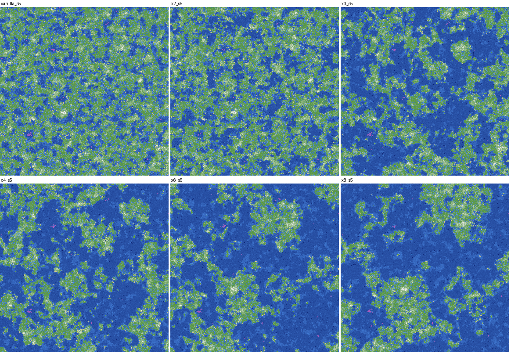
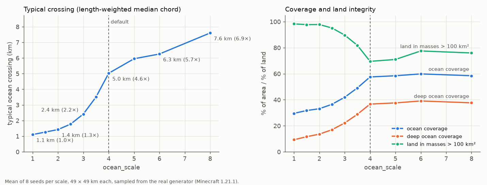
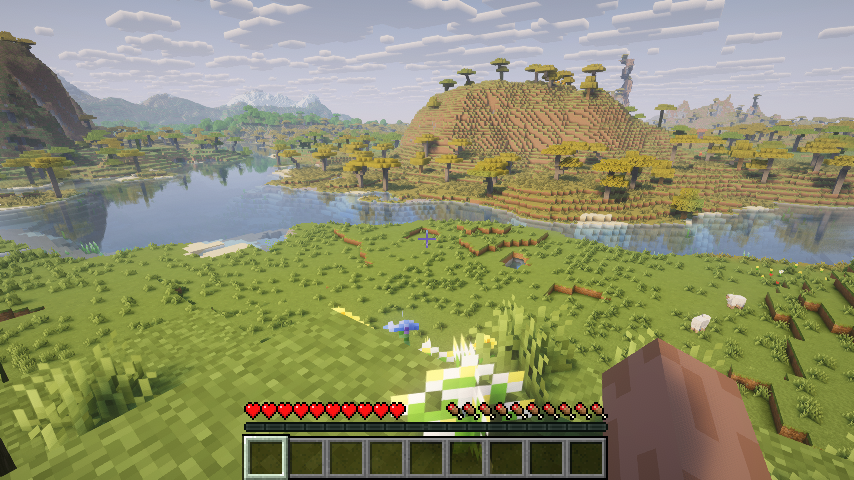

# Big Oceans

A Minecraft mod that makes oceans actually feel like oceans. It keeps vanilla world generation
and changes one thing: the geographic scale of the sea. With the default settings a typical
ocean crossing goes from about 1 km to about 5 km, deep ocean covers four times as much of the
world, and the seas join into one world ocean between large land masses. Terrain shapes, biomes,
beaches, rivers, caves and structures are still vanilla's.

Big Oceans is open source (MIT) and in development. The 1.21.1 builds have been measured and
tested in depth (numbers below); treat everything as a beta.



## Installing

| Minecraft | Loader | Jar |
|---|---|---|
| 1.21.1 | Fabric Loader 0.15+ with Fabric API | `big_oceans-fabric-<version>+1.21.1.jar` |
| 1.21.1 | Quilt Loader with Fabric API | the Fabric jar |
| 1.21.1 | NeoForge 21.1 | `big_oceans-neoforge-<version>+1.21.1.jar` |

Install it before creating the world: it only shapes chunks that are generated while it is
installed.

World generation happens on the server, so the mod is needed only where the world is generated:
on a dedicated server, or in the client for singleplayer and LAN hosting. Players joining a Big
Oceans server do not need it; an unmodded client was tested joining both a Fabric and a NeoForge
server. Nothing is synced to clients.

## Configuration

There is one option, `ocean_scale`, in `config/big_oceans.toml`:

```toml
ocean_scale = 4.0   # 1.0 = vanilla, up to 8.0, fractional values are fine
```

The global file is the default for new worlds. The first time a world loads, the value is copied
to `<world>/big_oceans.toml` and that world keeps its own copy, so changing the default never
alters an existing world. Editing the world's copy later only affects chunks generated afterwards
and leaves visible seams. Out-of-range values are clamped and invalid ones fall back to 4.0, with
a warning in the log.

What the scale does, measured over 8 seeds of 49 × 49 km each:

| `ocean_scale` | Ocean | Deep ocean | Typical crossing | 90% of the sea is within | Land in masses > 100 km² |
|---|---|---|---|---|---|
| 1.0 (vanilla) | 30 % | 9 % | 1.1 km | 394 blocks of land | 98 % |
| 2.0 | 33 % | 14 % | 1.4 km | 656 | 98 % |
| 3.0 | 42 % | 22 % | 2.4 km | 1 153 | 90 % |
| 3.5 | 49 % | 29 % | 3.5 km | 1 419 | 82 % |
| **4.0 (default)** | 58 % | 37 % | 5.0 km | 1 702 | 70 % |
| 6.0 | 60 % | 39 % | 6.3 km | 2 352 | 78 % |
| 8.0 | 58 % | 38 % | 7.6 km | 2 672 | 76 % |

Up to 4.0 the scale mostly adds ocean. From 4.0 the ocean share stays near 58 % and the oceans,
and the continents between them, just get wider. Between 3.0 and 4.0 the separate seas join into
one connected world ocean, so that range changes the character of a world the fastest.



## How it works

In the overworld noise router, almost everything that decides land or sea comes from one density
function, `minecraft:overworld/continents` (continentalness): terrain offset, factor,
jaggedness, depth and the climate parameter the biomes are picked from all reference that one
ID. Big Oceans overrides that single file with a data-pack JSON that wraps vanilla
continentalness in a small density function of its own, `big_oceans:ocean_basins`:

- A second, very low-frequency noise marks where ocean basins are.
- Inside a basin, vanilla continentalness is compressed into the deep-ocean band, so the terrain
  becomes deep ocean floor and the climate picks ocean biomes. Rare high points survive as
  mid-ocean islands, and mushroom-island cores are kept.
- Away from basins a small land bias merges vanilla land into larger continents.
- Near basin edges the vanilla value dominates, so coastlines, beaches and biome transitions keep
  vanilla's shape and width.
- The effect fades out between 1 024 and 2 560 blocks from the origin. Vanilla only searches for
  a spawn point within 2 048 blocks, so spawning behaves exactly as in vanilla, without a mixin.

Terrain and biomes read the same modified value, so they stay consistent with each other. There
are no mixins, no replaced chunk generator and no per-block code: the function runs inside
vanilla's flat cache, once per 4 × 4 column, like continentalness itself. The override also covers
the Large Biomes world type. The code is one density function, a config file and two small loader
entrypoints (`common/`, `fabric/`, `neoforge/`).

Other approaches were built and measured before this one. Sampling the whole continentalness
field at a lower frequency made crossings wider but left ocean coverage at 30 %, made beaches 2 to
4 times wider and grew one giant mushroom island. Blending in a lower-frequency copy widened
beaches too and shifted the biome mix. Carving basins without the land bias broke the land into
islands.

## Compatibility

Tested on real dedicated servers (Chunky pregeneration, then the saved chunks read back and
compared) and in real production clients, all on 1.21.1:

| Platform / mod | Result |
|---|---|
| Fabric 0.19.5, Quilt 0.30.1, NeoForge 21.1.252 | Works. Quilt runs the Fabric jar. The same seed gives the same terrain on every loader. |
| Sinytra Connector + Forgified Fabric API | The Fabric jar works on NeoForge through Connector. |
| Forge | Not built. NeoForge covers the Forge line on 1.21.1. |
| Sodium, Iris (with a shader pack), Embeddium | Work (client sessions with each renderer, no errors). |
| Lithium, C2ME, FerriteCore, ModernFix | Work; terrain is unchanged by them. C2ME's density-function handling copes with the custom type. |
| ImmediatelyFast, Entity Culling | Work. |
| Distant Horizons 3.3.3 | Builds and renders LODs of Big Oceans terrain on Fabric and NeoForge clients, and runs on a dedicated server. DH together with Chunky crashes a dedicated server at world load with or without Big Oceans; that is a DH/Chunky problem. |
| Terralith | Combines: Big Oceans' oceans on Terralith's terrain and biomes. |
| Tectonic | Nothing breaks, but Big Oceans has no effect: Tectonic ships its own noise router, which does not read `overworld/continents`. |
| Packs that also override `overworld/continents` | Conflict (only one file wins). Not tested. |
| Vanilla client joining a Big Oceans server | Works on Fabric and NeoForge servers. |
| LAN, Quilt client | Not tested. |

"Works" means the world was created, chunks generated and saved without errors, and the saved
chunks still had Big Oceans' geography. Two runs of Big Oceans alone agree on about 97.5 % of
column heights (multithreaded tree placement is not bit-for-bit reproducible), and the
optimisation mods stay at that level, so they do not change terrain.



Structures still generate, all 20 types checked with `/locate` from 12 points outside the spawn
area. Ocean structures end up closer together (median distance to a monument 726 blocks instead
of 1 024) and land structures farther apart (mansions 5 416 instead of 2 779), because their
biomes cover less area. Strongholds and trial chambers are unchanged.

Adding Big Oceans to an existing world was tested too: all 1 138 existing chunks stayed
byte-identical, the new ones used Big Oceans, and the log warned about the seam.

## Measurements

A dev-only Fabric mod in `fabric/src/lab` builds the real generator for any seed and samples
pre-feature terrain height and surface biome on a grid, by default 49 × 49 km at one sample every
128 blocks. `tools/analyze.py` turns the grids into statistics and maps. To check that the lab
measures what the game really saves, regions of 2 × 2 km with about half ocean were pregenerated
on a real server and read back from the region files: lab and game agree on water or land for
99.4–99.7 % of columns and on ocean biomes for 99.99–100 %, for vanilla and for Big Oceans.

Default against vanilla, mean of 48 seeds (1–8 and 101–140):

| | Vanilla | Big Oceans 4.0 | Big Oceans, range over seeds |
|---|---|---|---|
| Ocean coverage | 29.8 % | 57.8 % | 49 – 67 % |
| Deep ocean | 9.4 % | 37.1 % | 29 – 45 % |
| Typical crossing (length-weighted median chord) | 1 112 blocks | 5 171 | 3 328 – 7 424 |
| 95th percentile chord | 1 947 | 8 045 | 5 402 – 10 496 |
| 90th percentile distance to land | 393 | 1 752 | 1 336 – 2 432 |
| Largest connected ocean, share of all ocean | 5 % | 70 % | 35 – 94 % |
| Land in masses > 100 km² | 98 % | 70.5 % | 35 – 92 % |
| Largest land mass in the window | 1 663 km² | 465 km² | 167 – 995 |
| Beach width | 22.6 blocks | 20.6 | 19.2 – 21.9 |
| Land biome mix, divergence from vanilla | — | 0.001 | |
| Spawn on land | 47 / 48 | 47 / 48 | |

The one spawn off land is seed 137, where vanilla fails the same way. The typical crossing is the
length of the ocean run a random point at sea lies on, along rows and columns; the plain median is
much lower (408 and 659) because it counts every short run across a bay or channel.

Performance was measured on a real Fabric server by pregenerating 16 641 chunks in each of three
mixed land and sea regions: 617 s in vanilla, 578 s with Big Oceans. The extra function has no
measurable cost; the difference comes from there being more ocean, which has fewer features to
place. Server startup was 11.1 s against 10.5 s.

## Building and testing

You need JDK 21.

```sh
./gradlew build            # jars in fabric/build/libs and neoforge/build/libs
./gradlew :common:test     # unit tests (config parsing, basin shape, scale 1.0 is exactly vanilla)
```

The measurement and compatibility tooling is in `tools/` (Python; `pip install -r
tools/requirements.txt`):

```sh
./gradlew :fabric:runLab -PlabJobs=tools/jobs/calib2.json   # sample 104 worlds into build/lab/calib2
python tools/analyze.py build/lab/calib2 --maps             # statistics and one map per world
python tools/regression.py build/lab/regression             # known seeds against a stored baseline
python tools/server.py setup fabric build/servers/fabric    # real servers (also neoforge, quilt)
python tools/bench.py fabric out.json 5:-7680:-1024         # vanilla against Big Oceans, same region
python tools/compat.py fabric out.json 5:-7680:-1024 name=a.jar,b.jar ...
python tools/client.py fabric build/client/fabric --world <save> --mods <jars>
```

`tools/jobs/regression.json` covers the seeds that were extreme during calibration: 134 (most
ocean), 135 (least), 105 (smallest largest continent), 140 (most fragmented land) and 137 (vanilla
spawn failure). The check compares them against values from the calibration run and currently
passes with no differences, which also shows the shipped data pack produces exactly the
calibrated worlds.

`compat.py` pregenerates a region with Chunky next to other mods and compares the saved chunks
with a run of Big Oceans alone; `client.py` launches a production client through
[portablemc](https://github.com/mindstorm38/portablemc) straight into a world or server and takes
in-game screenshots. Test mods are expected in `build/testmods/<loader>/`.

## Limitations

- Continents are smaller than vanilla's. Vanilla land in a 49 km window is practically one
  connected mass; with the default, the largest land mass averages 465 km², and on the most
  fragmented seeds only 35–40 % of the land is in masses over 100 km², so those worlds read as an
  ocean with large islands.
- Within about 1–2.5 km of the origin the geography is vanilla, by design (see the spawn fade).
- Existing chunks never change. Adding the mod to a world, or changing `ocean_scale` later, leaves
  visible seams between old and new terrain.
- Mods that override `overworld/continents` conflict, and mods that replace the overworld noise
  router (Tectonic) make Big Oceans do nothing.
- Between 3.0 and 4.0 small changes of `ocean_scale` change a world a lot (see above).
- Only 1.21.1 is supported so far.

## License

MIT
